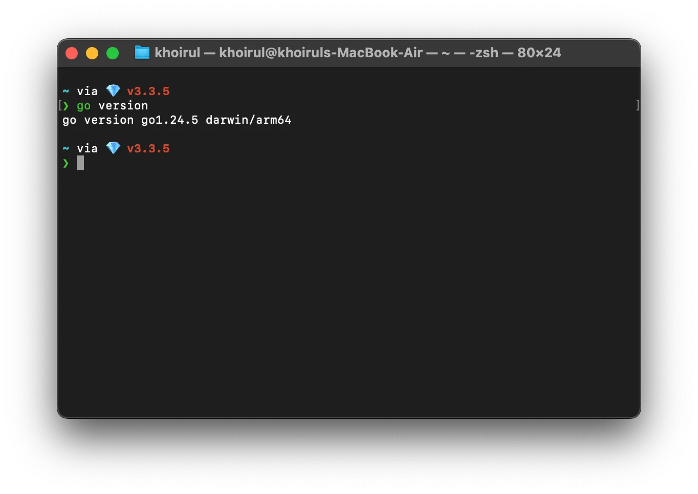
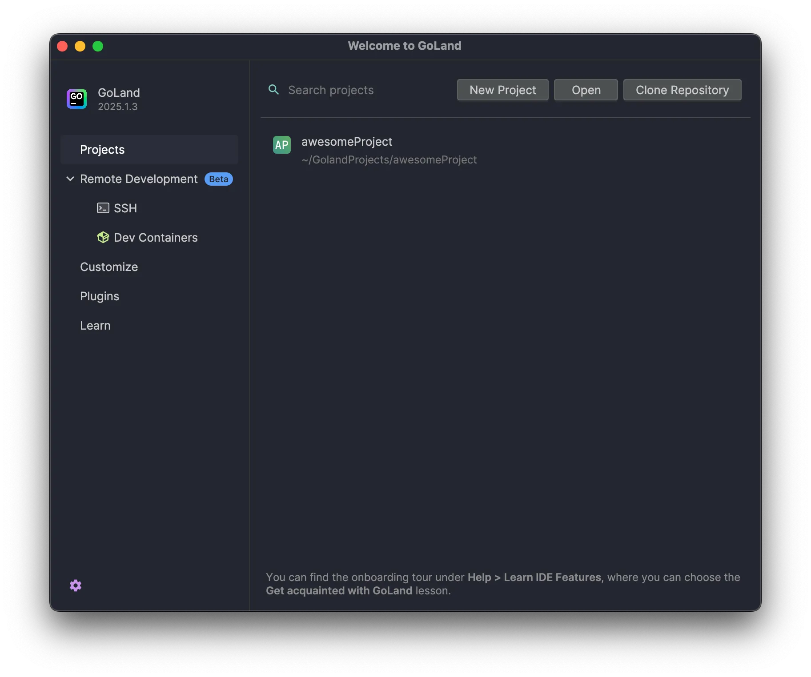
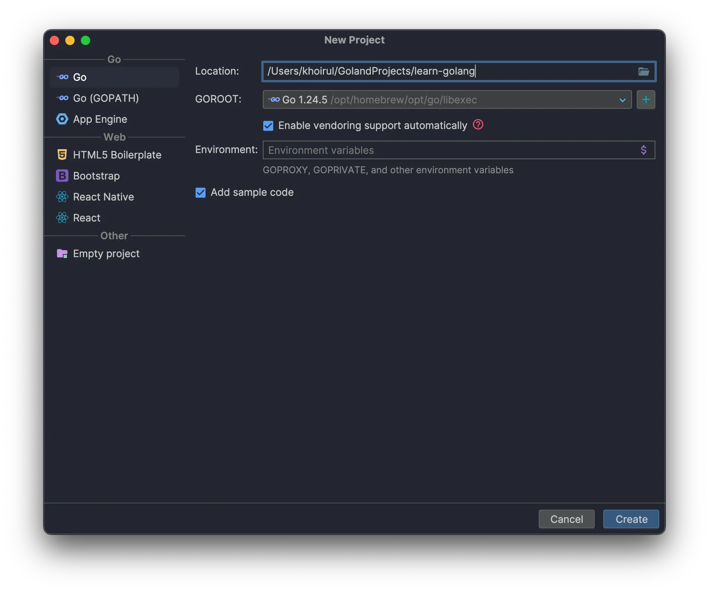
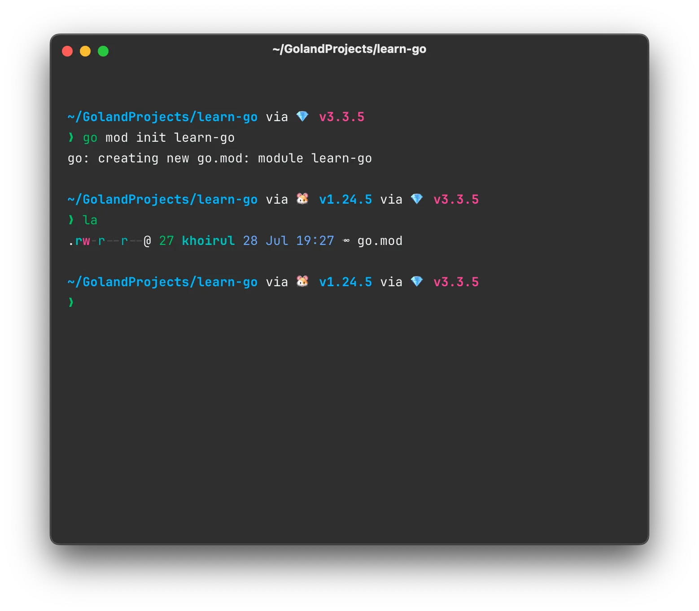

category: "notes"

Pernahkah kamu ingin membangun aplikasi backend yang super cepat seperti yang digunakan Gojek atau Tokopedia? Atau mungkin kamu sedang mencari bahasa pemrograman pertamamu yang simpel tapi sangat powerful? Jika iya, kamu datang ke tempat yang tepat.

Go, atau Golang, adalah bahasa yang dikembangkan oleh Google untuk menjawab kebutuhan software modern. Dengan sintaksnya yang bersih, performa yang luar biasa, dan kemampuannya dalam menangani banyak proses sekaligus (konkurensi), Go menjadi pilihan utama untuk membangun API, microservices, dan berbagai layanan backend lainnya.

Di seri blog **Becoming Gopher** ini, saya akan mengajak kamu untuk belajar Go dari nol, langkah demi langkah. Kita akan mulai dari hal paling dasar seperti instalasi, hingga akhirnya membuat sebuah proyek mini. Seri ini dirancang untuk pemula absolut, jadi jangan khawatir jika kamu belum pernah ngoding sebelumnya!

## Mengunduh dan Instalasi Go

Berikut adalah beberapa hal yang perlu diketahui sebelum membahas detail bahasa ini lebih lanjut.
Pertama, [https://go.dev](https://go.dev/) yang merupakan situs resmi bahasa ini dan akan menjadi sumber utama untuk:

- Mengunduh binary Go (yang berisi perintah `go` dan *tools* terkait lainnya) dari https://go.dev/doc/install
- Melihat dokumentasi resmi Go https://go.dev/doc/
- Melihat semua package Go https://pkg.go.dev/
- Mengakses Go Playground https://go.dev/play/

Untuk melakukan instalasi Go, download binary file pada link https://go.dev/doc/install berdasarkan sistem operasi yang digunakan.

Jalankan file instalasi dan pastikan perintah `go` bisa digunakan di terminal. Atau jika menggunakan sistem operasi MacOS, Go dapat diinstal menggunakan `brew` dengan perintah

```bash
brew install go
```



## Memilih dan Menyiapkan Code Editor

Ada beberapa code editor yang dapat digunakan disini, diantaranya:

- Visual Sudio Code https://code.visualstudio.com/
- Atau, JetBrains GoLand https://www.jetbrains.com/go/?var=1

Jika menggunakan Visual Studio Code, ekstensi yang harus diinstall adalah [Go Extension](https://marketplace.visualstudio.com/items?itemName=golang.go) yang dikembangkan dan dikelola oleh Google. Ekstensi ini dapat membantu penulisan kode Go karena beberapa fitur IntelliSense seperti code completion dan syntax highlighting serta beberapa fitur seperti auto formatting untuk membantu merapikan kode. Selain itu, ekstensi ini juga dapat membantu untuk melakukan instalasi package Go terpisah, melakukan testing dan banyak lagi.

## Membuat Modul Go Pertama Kita

Project di golang biasa disebut dengan **module**. Untuk membuat module, bisa menggunakan perintah

```bash
go mod init <nama-module>
```

Atau jika menggunakan IDE GoLand, membuat project baru bisa melalui tombol `New Project` di halaman pertama saat kita membuka GoLand. Kemudian akan diarahkan ke halaman untuk memasukkan informasi terkait project, seperti nama, GOROOT, dan *environment variables.* 

Di halaman ini juga terdapat opsi centang (checkbox) `Add sample code` jika ingin membuat file contoh dari bahasa Go ini. Jika sudah selesai, lanjutkan dengan menekan tombol `Create` di pojok kanan bawah halaman, dan akan secara otomatis project dibuka di window yang sama.





Jika project dibuat melalui CLI Go, maka akan dibuatkan file `go.mod`. Namun jika project dibuat menggunakan GoLand dengan opsi `Add sample code` aktif, maka akan dibuatkan juga file `main.go` yang berisi sampel kode program untuk bahasa Go.



Isi dari file `go.mod` dan penjelasan tiap barisnya adalah

```go
// nama module: learn-go
module learn-go

// versi minimum Go yang digunakan
// ini adalah versi yang digunakan untuk mengkompilasi kode Go
// pastikan untuk menggunakan versi Go yang sesuai dengan kode kalian
// Kalian dapat mengubah versi ini sesuai dengan kebutuhan proyek kalian
// contoh: go 1.18
go 1.24.5
```

Selamat! Arena ngoding Go kamu sudah siap. Semua alat yang kita butuhkan sudah terpasang dan kita sudah punya sebuah modul kosong yang siap diisi.

Di postingan berikutnya, kita akan benar-benar menulis kode pertama kita dan berkenalan dengan konsep paling dasar di Go. Jangan sampai ketinggalan, ya!

<!-- Punya pertanyaan atau kesulitan saat instalasi? Jangan ragu untuk bertanya di kolom komentar di bawah! -->