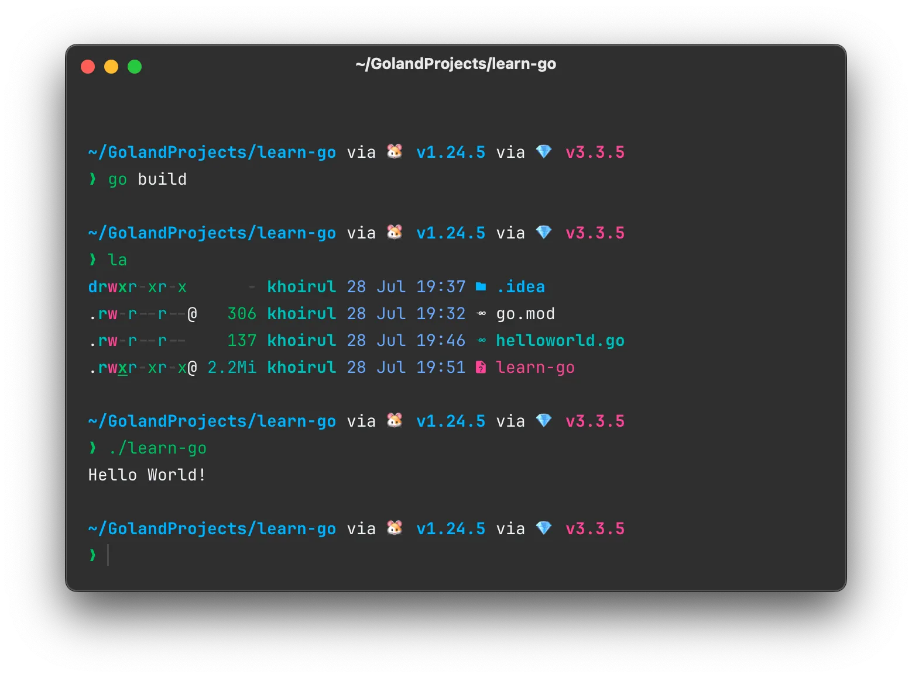
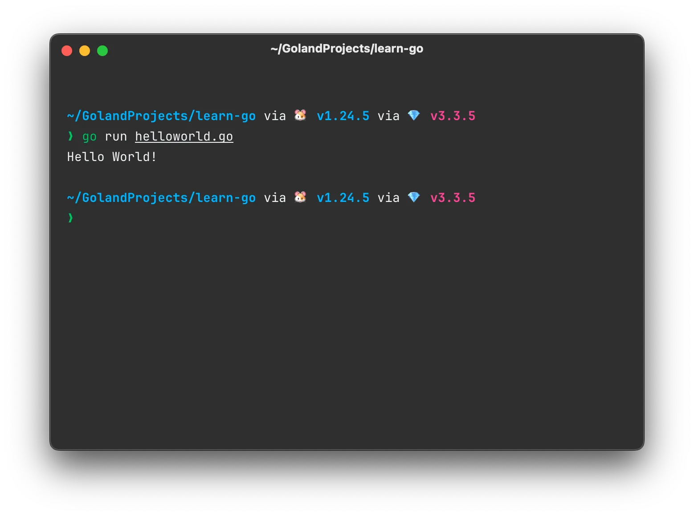
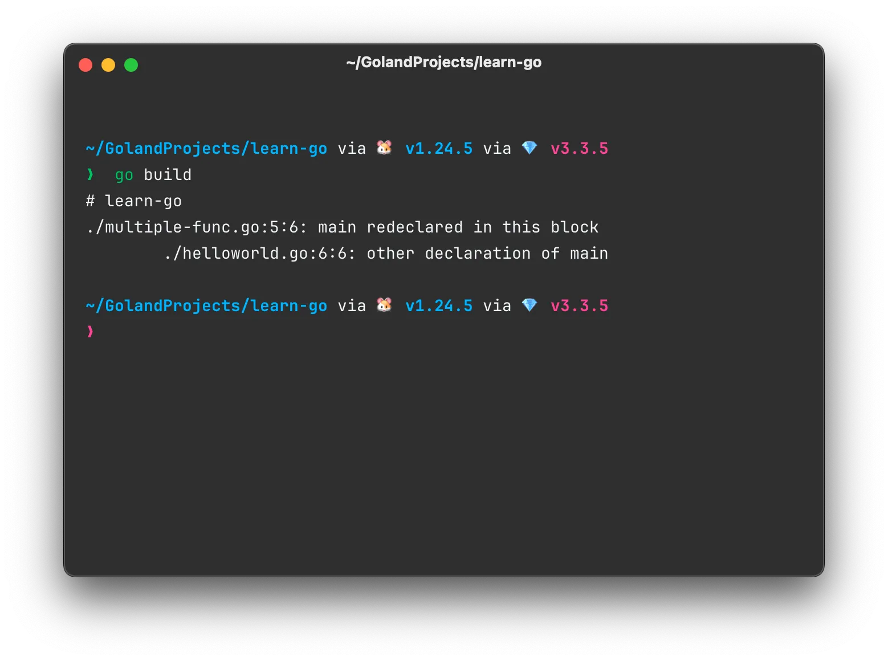

Selamat datang kembali di seri **Becoming Gopher**! Jika kamu sudah [mengikuti bagian pertama](./from-zero-menyiapkan-arena-ngoding-go), itu artinya 'arena' kita sudah siap tempur. Go sudah terpasang, *code editor* sudah siap, dan sebuah modul kosong menanti untuk kita isi. *Well done*!

Bayangkan di postingan sebelumnya kita baru saja mengemas ransel, memeriksa peta, dan tiba di kaki gunung. Hari ini, kita akan benar-benar mengambil langkah pertama di jalur pendakian. Kita akan meninggalkan jejak pertama kita di dunia Go.

Di bagian kedua ini, kita akan melakukan tiga hal fundamental yang akan menjadi dasar dari semua program yang akan kita buat nanti:

1. Menyapa Dunia: Kita akan menjalankan tradisi sakral setiap programmer, yaitu membuat program "Hello, World!" untuk memastikan semuanya berfungsi
2. Mengenal Bahan Dasar: Kita akan belajar bagaimana Go 'memahami' berbagai jenis informasi, seperti teks (`string`), angka (`int`), dan logika benar-salah (`bool`).
3. Memberi Nama pada Data: Kita akan belajar cara menyimpan informasi-informasi tersebut menggunakan 'wadah' bernama `variabel` dan `konstanta`.

Siap untuk menulis baris kodemu yang pertama dan secara resmi memulai perjalananmu menjadi seorang Gopher? Buka *code editor*-mu, dan mari kita mulai!

## Hello World !

Bahasa Go mirip dengan bahasa C/C++, dimana harus ada fungsi `main`. Fungsi `main` adalah fungsi yang akan dipanggil ketika kode program dijalankan. Untuk membuat fungsi di Go, keyword yang bisa digunakan adalah `func` dan diikuti dengan nama fungsinya, seperti contoh kode dibawah.

```go
func main() { }
```

Fungsi `main` ini harus berada dalam package `main` nantinya.

:::note
Meskipun mirip dengan bahasa C/C++, titik koma (`;`) di Go tidaklah wajib.
:::

Kemudian, kita akan mencoba membuat file `helloworld.go` dengan isi kode seperti dibawah ini.

```go
// File: helloworld.go
// Package main adalah paket utama yang berisi fungsi utama program.
package main

func main() {
	/*
	* Fungsi ini adalah fungsi utama yang akan dieksekusi saat program dijalankan.
	* Di dalam fungsi ini, kita dapat menambahkan kode untuk menjalankan program kita.
	* Untuk saat ini, fungsi ini kosong dan tidak melakukan apa-apa.
	 */
}
```

### Println

Untuk mencetak teks ke konsol, kita perlu mengimpor package `fmt`.

```go
package main

// ini adalah program Go sederhana untuk mencetak "Hello World"
import "fmt"

func main() {
	fmt.Println("Hello World!")
}
```

Kemudian untuk menjalankan kode yang sudah dibuat, perlu dilakukan kompilasi. Untuk melakukan kompilasi, dapat menggunakan perintah `go build` di root dari folder project. Saat perintah ini dijalankan, compiler Go akan mencari semua `main` function yang ada di dalam folder project.

Output dari perintah ini adalah file binary sesuai sistem operasi yang digunakan. File binary tersebut dapat dijalankan dengan perintah `./<nama-hasil-kompilasi>` untuk MacOS dan Linux dan `<nama-hasil-kompilasi>.exe` untuk Windows.



Namun, akan merepotkan jika kode sering berubah dan harus sering-sering juga melakukan kompilasi kode dan menjalankannya. Karena itu Go CLI mendukung menjalankan kode program tanpa harus melakukan kompilasi terlebih dahulu, perintah yang dapat digunakan adalah `go run <nama-file>.go`.



:::warning
Perintah `go run ..` sebaiknya hanya dilakukan saat proses development. Pada saat project sudah jadi, tetap diharuskan untuk melakukan kompilasi kode.
:::

Oke, program pertama kita berhasil berjalan! Tapi, saat belajar, kita sering membuat banyak file untuk mencoba kode. Nah, ada satu 'aturan main' penting di Go yang perlu kamu tahu terkait fungsi main ini.

## Multiple `main` function

Bayangkan setiap *package* `main` adalah sebuah kapal. Sebuah kapal hanya bisa punya satu kapten yang meneriakkan perintah 'Jalan!', yaitu fungsi `main()`. Jika ada dua kapten di kapal yang sama, para kru (`compiler`) akan bingung dan menolak untuk berlayar.

Di Go, nama fungsi yang diekspor (diawali huruf kapital) harus unik dalam **satu package**. Secara khusus, kalian tidak bisa mendeklarasikan lebih dari satu fungsi `main()` di dalam **package `main`**, karena itu akan menyebabkan konflik saat kompilasi.

Karena itu jika kita membuat file baru lagi di module sebelumnya dan menulis fungsi `main`, kode tidak dapat dilakukan kompilasi karena terdapat dua fungsi yang sama, yakni fungsi `main`.



Solusinya adalah dengan menjalankan file `.go` satu persatu, hal ini **diperbolehkan dengan keperluan pembelajaran atau pengembangan** saja. Dengan catatan, nantinya saat membuat module baru, pastikan tidak ada nama fungsi yang sama dalam satu modul, khususnya fungsi `main`.

Sekarang kita sudah tahu cara menjalankan program dan aturan dasarnya. Langkah selanjutnya adalah mengenal 'bahan baku' dari setiap program: Tipe Data. Sebelum bisa menyimpan atau mengolah informasi, kita perlu memberitahu Go jenis informasi apa yang sedang kita hadapi.

## Tipe data

### Number

Di dalam Golang, ada dua tipe data number:

- integer (bilangan bulat)
- floating point (bilangan desimal)

Meskipun integer adalah adalah bilangan bulat, tapi dibagi lagi menjadi beberapa tipe data lagi lebih spesifik seperti di tabel dibawah.

| Tipe Data | Nilai Minimum | Nilai Maksimum |
| --- | --- | --- |
| `int8` | -128 | 127 |
| `int16` | -32768 | 32767 |
| `int32` | -2147483648 | 2147483647 |
| `int64` | -9223372036854775808 | 9223372036854775807 |

Selain itu juga ada tipe data untuk bilangan bulat yang **non-negatif** seperti pada tabel dibawah.

| Tipe Data | Nilai Minimum | Nilai Maksimum |
| --- | --- | --- |
| `uint8` | 0 | 255 |
| `uint16` | 0 | 65535 |
| `uint32` | 0 | 4294967295 |
| `uint64` | 0 | 18446744073709551615 |

Kemudian ada juga tipe data *floating point* atau desimal, rincian masing-masing ada di tabel dibawah.

| Tipe Data | Nilai Minimum | Nilai Maksimum |
| --- | --- | --- |
| `float32` | 1.18×10^−38 | 3.4×10^38 |
| `float64` | 2.23×10^−308 | 1.80×10^308 |
| `complex64` | complex numbers with float32 real and imaginary parts. |  |
| `complex128` | complex numbers with float64 real and imaginary parts. |  |

:::note
Tipe data `complex*` jarang digunakan, khususnya untuk aplikasi sederhana. Kecuali aplikasi yang dibuat membutuhkan operasi matematis kompleks.
:::

Selain itu juga ada Alias. Alias adalah nama lain yang bisa digunakan untuk menggantikan pemanggilan tipe data `number` sebelumnya.

| Tipe Data | Alias untuk |
| --- | --- |
| `byte` | uint8 |
| `rune` | int32 |
| `int` | Minimal int32 |
| `uint` | Minimal uint32 |

:::note
Semakin besar tipe data yang digunakan, semakin besar pula ukuran memori yang digunakan. **Jadi gunakan tipe data sesuai data yang disimpan.**
:::

### Boolean

Tipe data boolean adalah tipe data yang hanya memiliki dua nilai, yaitu **benar** dan **salah**. Di Golang, keyword tipe data boolean adalah `bool`.

| Nilai | Keterangan |
| --- | --- |
| `true` | benar |
| `false` | salah |

### String

String adalah tipe data kumpulan tipe data kumpulan karakter, mulai dari kosong hingga lebih dari 1. Jumlah karakter dalam string mulai dari 0 hingga tak terhingga. Tipe data string di Golang menggunakan keyword `string`. Cara membuat string adalah dengan menggunakan tanda petik dua (`”hello world!”`).

Ada beberapa operasi yang bisa dilakukan pada tipe data `string`:

| Fungsi | Keterangan | Output |
| --- | --- | --- |
| `len("string")` | menghitung jumlah karakter **termasuk spasi** | 6 |
| `"string"[0]`  | mengambil nilai **byte** dari karakter pada posisi yang ditentukan (dalam format UTF-8). | 115 |

## Variabel

Bayangkan variabel sebagai sebuah 'kotak' atau 'wadah' yang bisa kita beri label (nama variabel) dan kita isi dengan data (nilai). Kita bisa melihat isinya kapan saja, atau bahkan mengganti isinya dengan data baru.

Di Golang, variabel hanya bisa menyimpan data dengan tipe data yang sama saja, karena itu jika ada banyak data dengan tipe data berbeda-beda, maka harus membuat banyak variabel.

Untuk membuat variabel bisa menggunakan keyword `var <nama-variabel> <tipe-data>`.

```go
package main

import "fmt"

func main() {
	// inisialisasi variabel dengan tipe data int8
	var age int8
	
	// mengubah nilai variabel age
	age = 20
	fmt.Println(age) // 20
	
	age = 30
	fmt.Println(age) // 30
}
```

Saat membuat variabel, maka harus juga menyebutkan tipe datanya. Namun ketika membuat variabel diikuti dengan menginisialisasi data pada variabelnya, maka tipe datanya tidak harus disebutkan.

```go
var name = "John Doe"
fmt.Println(name) // John Doe
```

### Keyword `var`

Keyword `var` pada saat membuat variabel di golang tidaklah wajib, asalkan saat membuat variabel kita langsung mendefinisikan nilainya. 

Untuk menggantikan keyword `var`, kita harus menggunakan simbol titik dua dan sama dengan (`:=`) yang menggantikan sama dengan (`=`).

```go
address := "123 Main St"
fmt.Println(address) // 123 Main St
```

### Deklarasi *multiple variable*

Di Golang, membuat beberapa variabel sangat memungkinkan. Ini dapat membuat kode yang ditulis jauh lebih bersih dan mudah dibaca

```go
var (
	city    = "Surabaya"
	country = "Indonesia"
)
	
fmt.Println(city, country) // Surabaya Indonesia
```

## Constant

Constant adalah variabel yang **nilainya tidak bisa diubah lagi** setelah variabel tersebut diisi. Untuk membuat constant sama dengan membuat variabel, bedanya jika variabel menggunakan keyword `var` maka constant menggunakan keyword `const`. Saat membuat constant, kita harus langsung membuat inisialisasi data.

Mengapa repot-repot menggunakan `const` jika ada `var`? Tujuannya adalah untuk keamanan dan kejelasan. Dengan `const`, kita memberitahu programmer lain (dan diri kita sendiri di masa depan) bahwa nilai ini adalah sebuah patokan yang sakral dan tidak boleh diubah-ubah, seperti nilai Pi atau jumlah hari dalam seminggu.

```go
package main

import "fmt"

func main() {
	const pi float32 = 3.14
	fmt.Println(pi) // 3.14
}
```

Sama seperti variabel, kita juga bisa dapat membuat banyak constant sekaligus

```go
const (
	day   = 24 * 60 * 60 // seconds in a day
	month = 30 * day     // seconds in a month
	year  = 365 * day    // seconds in a year
)

fmt.Println("Seconds in a day:", day) // Seconds in a day: 86400
fmt.Println("Seconds in a month:", month) // Seconds in a month: 2592000
fmt.Println("Seconds in a year:", year) // Seconds in a year: 31536000
```

## Type Declaration: Membuat Tipe Data Sendiri (Versi Sederhana)

Terkadang, menggunakan nama tipe data bawaan seperti `string` atau `int` terasa kurang deskriptif. Go memungkinkan kita untuk membuat 'alias' atau nama baru untuk tipe data yang sudah ada. Ini disebut **Type Declaration**.

Tujuannya adalah untuk membuat kode lebih mudah dibaca dan dimengerti. Misalnya, daripada menggunakan `string` untuk menyimpan KTP dan email, kita bisa membuat tipe baru.

```go
func main() {
    // Membuat tipe data baru bernama NoKTP dan Email dari string
	type NoKTP string
	type Email string

	var ktpBudi NoKTP = "1234567890"
	var emailBudi Email = "budi@email.com"

	fmt.Println("No KTP Budi:", ktpBudi)
	fmt.Println("Email Budi:", emailBudi)
}
```

Meskipun di belakang layar `NoKTP` dan `Email` adalah `string`, penggunaan *type declaration* membuat maksud dari variabel tersebut menjadi jauh lebih jelas.

## Petualangan Hari Ini Selesai!

Wow, selamat! Kamu sudah melewati salah satu bagian terpenting dalam perjalanan "Becoming Gopher". Hari ini kita tidak hanya berhasil membuat program Go pertama kita, tapi juga sudah berkenalan dengan cara Go melihat dan menyimpan berbagai jenis data.

Secara singkat, kita sudah belajar:
- Menjalankan program Go dengan `go run`.
- Aturan dasar fungsi `main` dalam sebuah package.
- Tipe data fundamental: Angka (`int`, `float`), Logika (`bool`), dan Teks (`string`).
- Cara menyimpan data dalam 'wadah' yang bisa diubah (`variabel`) dan yang tidak bisa diubah (`konstanta`).

Di postingan selanjutnya, kita akan mulai 'mengolah' bahan-bahan dasar ini. Kita akan belajar bagaimana melakukan operasi matematika, perbandingan, dan mulai mengatur alur program kita dengan logika `if` dan `switch`.
