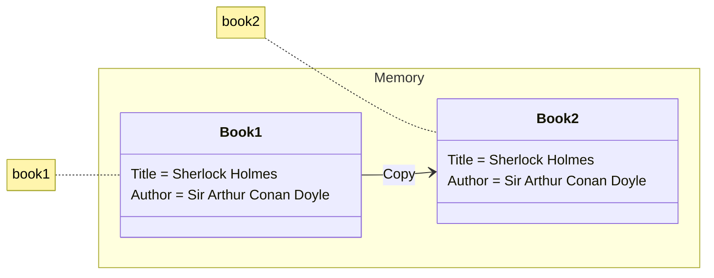
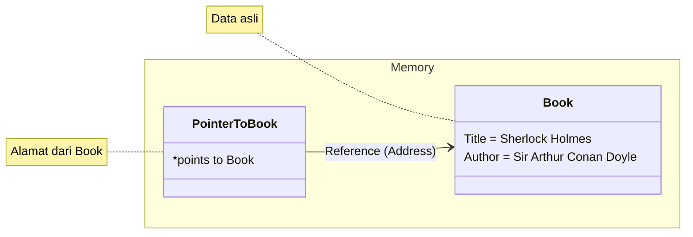

category: "notes"

Selamat datang kembali di petualangan **Becoming Gopher**! Di [babak sebelumnya](./membuat-tipe-data-sendiri-struct-method-dan-interface), kita sudah berhasil menjadi desainer handal dengan menciptakan tipe data kita sendiri menggunakan `struct`, `method`, dan `interface`.

Hari ini, kita akan menghadapi salah satu topik yang paling sering dianggap 'momok' bagi para programmer pemula: **Pointer**. Namanya terdengar teknis dan rumit, tapi jangan khawatir! Pointer sebenarnya adalah konsep yang sederhana dengan manfaat yang luar biasa besar.

Bayangkan pointer seperti **alamat rumah**. Daripada memberikan seluruh rumah (menyalin data besar), kita cukup memberikan secarik kertas berisi alamatnya. Lebih cepat, lebih efisien, dan jika kita mau, kita bisa menyuruh seseorang (sebuah fungsi) untuk mengubah cat rumah asli berdasarkan alamat tersebut.

Di postingan ini, kita akan membongkar misteri pointer langkah demi langkah, mulai dari 'mengapa' kita membutuhkannya, hingga cara menggunakannya di fungsi dan method. Tujuannya satu: membuatmu berteman baik dengan pointer.

Tarik napas dalam-dalam, kosongkan pikiran dari mitos-mitos seram tentang pointer, dan mari kita mulai petualangan ini!

## Kenapa Kita Butuh Pointer?

Sebelum masuk ke teknis, kita harus tahu *mengapa* Go secara eksplisit menggunakan pointer. Ada dua alasan utama:

1.  **Efisiensi 🏃‍♂️:** Secara default, saat kita mengirim data ke sebuah fungsi, Go akan **menyalin seluruh data** tersebut (*pass by value*). Jika datanya adalah sebuah `struct` besar, proses penyalinan ini boros memori dan waktu. Dengan mengirim *pointer* (alamat memori), kita hanya menyalin alamat yang ukurannya sangat kecil, tanpa peduli seberapa besar data aslinya.
2.  **Kemampuan Mengubah Data Asli ✍️:** Terkadang, kita ingin sebuah fungsi bisa mengubah nilai variabel yang ada di luar fungsi tersebut. Tanpa pointer, fungsi hanya akan mengubah salinannya. Dengan pointer, fungsi bisa langsung memodifikasi data di lokasi aslinya.

## Salinan vs. Alamat Asli (`Pass by Value` vs. `Pass by Reference`)

Secara default, Go adalah **`pass by value`**. Artinya, setiap kali Kalian mengirim variabel ke sebuah fungsi, Go membuat salinannya.


*Ilustrasi: Saat `pass by value`, sebuah salinan baru dari data dibuat di memori.*

Sebaliknya, dengan menggunakan pointer, kita menerapkan konsep **`pass by reference`**. Kita tidak mengirim datanya, melainkan hanya alamat memorinya. Fungsi yang menerima alamat ini bisa langsung berinteraksi dengan data aslinya.



*Ilustrasi: Saat `pass by reference`, kita hanya mengirim referensi (alamat) ke data yang asli.*

## Operator Sakti: `&` dan `*`

Untuk bekerja dengan pointer, kita hanya perlu mengenal dua operator utama.

### Operator `&` (Address-Of) - Mendapatkan Alamat

Operator `&` digunakan untuk **mengambil alamat memori** dari sebuah variabel. Hasilnya adalah sebuah nilai pointer.

```go
nama := "Gopher"
// `pointerKeNama` sekarang menyimpan alamat memori dari variabel `nama`
pointerKeNama := &nama 

fmt.Println("Nilai asli:", nama)
fmt.Println("Alamat memori:", pointerKeNama)
```

### Operator `*` (Dereference) - Mengakses Nilai
Jika `&` adalah cara mendapatkan alamat, `*` adalah cara untuk mengakses atau mengubah nilai yang ada di alamat tersebut.

```go
a := 10
ptr := &a // ptr menyimpan alamat dari a

fmt.Println("Alamat:", ptr)  // misal: 0xc0000b4008
fmt.Println("Nilai di alamat itu:", *ptr) // Mengakses nilai -> 10

// Mengubah nilai di alamat itu
*ptr = 25
fmt.Println("Nilai `a` sekarang:", a) // Nilai `a` ikut berubah menjadi 25
```

Jangan khawatir dengan `0xc0000b4008`! Itu adalah representasi alamat memori dalam format heksadesimal. Angka persisnya akan selalu berbeda setiap kali program dijalankan.

:::note
**Ambiguitas Operator `*` yang Wajib Dipahami!**

Bagi pemula, `*` bisa membingungkan karena punya dua makna tergantung konteks:
1. **Sebagai Penanda Tipe:** Saat di deklarasi, `*TipeData` (misal: `*int`) berarti "sebuah pointer yang menunjuk ke tipe data tersebut".
2. **Sebagai Operator Dereference**: Saat digunakan pada variabel, `*namaPointer` berarti "akses nilai yang ada di alamat yang ditunjuk".

Membedakan dua konteks ini adalah kunci utama memahami pointer.
:::

## Cara Lain Membuat Pointer: `new()`
Selain menggunakan `&` pada variabel yang sudah ada, kita bisa menggunakan fungsi bawaan `new()` untuk membuat pointer baru. Fungsi `new(T)` akan:
1. Mengalokasikan memori untuk tipe data `T`.
2. Memberinya nilai nol (*zero value*).
3. Mengembalikan alamat memori (pointer) ke lokasi tersebut.

```go
// Membuat pointer ke sebuah integer. Nilai integer-nya adalah 0.
ptr := new(int) 

fmt.Println("Alamat:", ptr)
fmt.Println("Nilai awal:", *ptr) // 0

*ptr = 100
fmt.Println("Nilai baru:", *ptr) // 100
```

### Kapan pakai `new` vs. `&`?
- Gunakan `&` jika kalian sudah punya variabel dengan nilai tertentu dan ingin mendapatkan pointernya. (`p := &variabel`)
- Gunakan `new` jika kalian ingin membuat pointer baru dari nol tanpa harus mendeklarasikan variabelnya terlebih dahulu.

## Pointer dalam Aksi (Fungsi & Method)
Inilah alasan utama kita belajar pointer: efisiensi dan kemampuan modifikasi.

### Pointer di Parameter Fungsi
Lihat perbedaan drastis antara mengirim nilai dan mengirim pointer ke sebuah fungsi.
Tanpa Pointer (Pass by Value):

```go
func ubahNamaGagal(nama string) {
	nama = "Bukan Gopher" // Hanya mengubah salinan
}

func main() {
	namaAsli := "Gopher"
	ubahNamaGagal(namaAsli)
	fmt.Println("Nama asli tetap:", namaAsli) // Nama asli tetap: Gopher
}
```
Dengan Pointer (Pass by Reference):

```go
func ubahNamaSukses(nama *string) {
	*nama = "Gopher Sejati" // Mengubah nilai di alamat asli
}

func main() {
	namaAsli := "Gopher"
	ubahNamaSukses(&namaAsli) // Kirim alamatnya
	fmt.Println("Nama asli berubah:", namaAsli) // Nama asli berubah: Gopher Sejati
}
```

### Pointer di Method Receiver
Konsep yang sama berlaku untuk `method`. Jika kita ingin sebuah `method` bisa mengubah data `struct`-nya, kita harus menggunakan pointer receiver.

Tanpa Pointer Receiver:
```go
type Player struct {
	Health int
}

// Method ini menerima SALINAN dari Player
func (p Player) TakeDamage(damage int) {
	p.Health -= damage
}

func main() {
	player1 := Player{Health: 100}
	player1.TakeDamage(20)
	fmt.Println("Health:", player1.Health) // Health: 100 (Tidak berubah!)
}
```

Dengan Pointer Receiver:
```go
type Player struct {
	Health int
}

// Method ini menerima ALAMAT dari Player
func (p *Player) TakeDamage(damage int) {
	p.Health -= damage // Go otomatis melakukan dereference
}

func main() {
	player1 := Player{Health: 100}
	player1.TakeDamage(20)
	fmt.Println("Health:", player1.Health) // Health: 80 (Berubah!)
}
```

:::note
Saat memanggil method dengan pointer receiver (`player1.TakeDamage(20)`), Go cukup pintar sehingga kita tidak perlu menulis `(&player1).TakeDamage(20)`. Ini adalah kemudahan sintaksis yang disediakan Go.
:::

## Petualangan Hari Ini Selesai!
Selamat, Gopher! Kamu baru saja melewati salah satu 'ujian' terpenting dalam perjalanan ini dan berhasil menaklukkan pointer. Topik yang tadinya tampak menyeramkan, ternyata hanyalah tentang mengelola 'alamat' dan 'nilai'.

Singkatnya, kita sudah belajar:
- Mengapa pointer penting untuk efisiensi dan modifikasi data.
- Perbedaan antara mengirim salinan (`pass by value`) dan alamat (`pass by reference`).
- Dua operator sakti: `&` untuk mendapatkan alamat, dan `*` untuk mengakses nilai.
- Cara menggunakan pointer di **fungsi** dan **method** untuk mengubah data asli.

Dengan pemahaman `struct`, `interface`, dan `pointer`, kita sudah punya hampir semua alat untuk membangun program yang kompleks. Di bab selanjutnya, kita akan belajar cara mengorganisir proyek kita secara profesional dengan `package` dan cara menangani kondisi darurat dengan sistem `error handling` Go.

<!-- Masih ada yang terasa membingungkan tentang pointer? Jangan ragu bertanya di kolom komentar. Diskusi adalah cara terbaik untuk belajar! -->