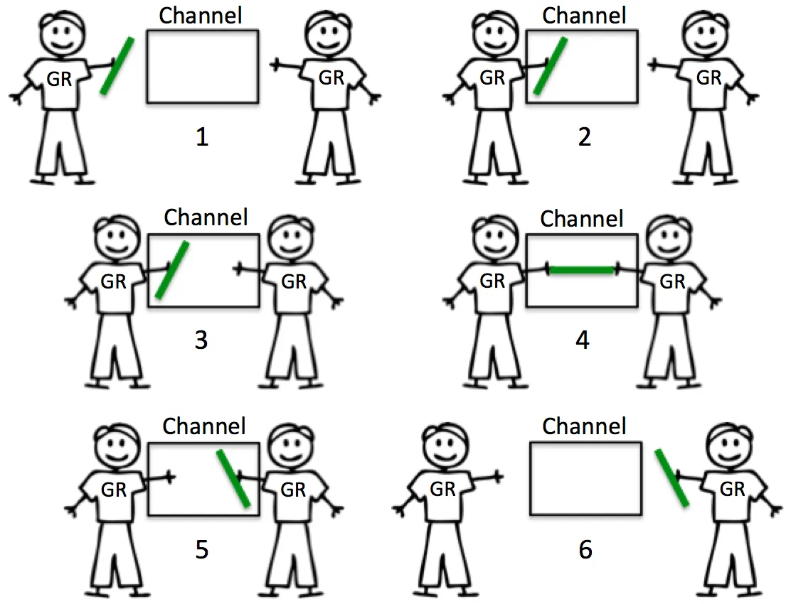

Selamat datang kembali di seri konkurensi **Becoming Gopher**! Di [episode sebelumnya](./pengenalan-konkurensi-goroutine), kita berhasil melepaskan kekuatan `goroutine` untuk menjalankan banyak pekerjaan sekaligus. Tapi, kita juga menemukan masalah besar: para 'pekerja' kita saling berebut data (*race condition*) dan 'bos' (`main goroutine`) tidak tahu kapan mereka selesai.

Bagaimana cara kita membuat para pekerja ini berinteraksi dengan tertib? Di dunia Go, ada sebuah filosofi yang sangat terkenal:

> "Don't communicate by sharing memory; instead, share memory by communicating."
>
> "Jangan berkomunikasi dengan berbagi memori; sebaliknya, berbagilah memori dengan berkomunikasi."

Artinya, daripada membiarkan banyak `goroutine` menyentuh variabel yang sama (berbagi memori) dan menguncinya, cara yang lebih baik adalah dengan membuat mereka saling mengirim pesan. Alat untuk mengirim pesan inilah yang disebut **Channel**.



Bayangkan *channel* seperti **ban berjalan (conveyor belt)** di sebuah pabrik. Satu `goroutine` (pekerja) menaruh barang di ban berjalan, dan `goroutine` lain mengambilnya di ujung. Semuanya aman, teratur, dan tidak ada yang saling sikut.

## Dasar-Dasar Channel

Mari kita lihat cara kerja 'pipa' data ini.

### Membuat, Mengirim, dan Menerima

Kita membuat *channel* menggunakan fungsi `make`. Tanda panah `<-` adalah operatornya.

```go
package main

import "fmt"

func main() {
	// 1. Membuat channel yang bisa menampung data string
	messages := make(chan string)

	// Jalankan sebuah goroutine untuk mengirim pesan ke channel
	go func() {
		// 2. Mengirim (menaruh) data ke channel
		messages <- "Halo dari goroutine lain!"
	}()

	// 3. Menerima (mengambil) data dari channel di main goroutine
	msg := <-messages
	fmt.Println(msg) // Output: Halo dari goroutine lain!
}
```

### Keajaiban Sinkronisasi (Unbuffered Channel)
Secara default, channel bersifat **unbuffered** dan **memblokir**. Artinya:
- Saat sebuah `goroutine` mengirim data ke *channel* (`ch <- data`), **ia akan berhenti dan menunggu** sampai ada `goroutine` lain yang siap menerima data tersebut.
- Saat sebuah `goroutine` mencoba menerima data dari *channel* (`data := <-ch`), **ia akan berhenti dan menunggu** sampai ada data yang dikirim.

Perilaku 'saling menunggu' ini adalah mekanisme sinkronisasi yang sangat kuat. Mari kita selesaikan masalah "main goroutine tidak menunggu" dari postingan sebelumnya, kali ini dengan cara yang benar.

```go
func worker(done chan bool) {
	fmt.Println("Bekerja...")
	time.Sleep(1 * time.Second)
	fmt.Println("Selesai.")
	
	// Kirim sinyal bahwa pekerjaan sudah selesai
	done <- true
}

func main() {
	done := make(chan bool)
	go worker(done)

	// Main goroutine akan berhenti di sini dan menunggu sinyal dari channel 'done'
	<-done 
	fmt.Println("Main goroutine juga selesai.")
}
```

Tidak perlu lagi `time.Sleep()` yang tidak pasti. `main` akan menunggu persis sampai `worker` selesai.

## Buffered Channel: Kotak Surat dengan Kapasitas
Terkadang, kita tidak ingin si pengirim langsung berhenti. Kita ingin ia bisa menaruh beberapa pesan terlebih dahulu sebelum menunggu. Di sinilah **Buffered Channel** berperan.

Bayangkan *buffered channel* seperti kotak surat. Kalian bisa memasukkan beberapa surat (sesuai kapasitasnya) tanpa harus menunggu tukang pos datang. Tapi jika kotak surat sudah penuh, Kalian harus menunggu.

```go
// Membuat buffered channel dengan kapasitas 2
ch := make(chan string, 2)

// Pengiriman pertama dan kedua tidak akan memblokir
ch <- "Pesan pertama"
ch <- "Pesan kedua"

// Pengiriman ketiga AKAN memblokir, karena kapasitas sudah penuh
// ch <- "Pesan ketiga" // baris ini akan menyebabkan deadlock jika tidak ada penerima

fmt.Println(<-ch) // Pesan pertama
fmt.Println(<-ch) // Pesan kedua
```

## Iterasi dan Menutup Channel
Bagaimana jika sebuah `goroutine` mengirim banyak pesan dan kita ingin membacanya semua? Kita bisa menggunakan perulangan `for range` pada *channel*.

Perulangan ini akan otomatis berhenti jika *channel* ditutup.

:::note 
Penting: Hanya si pengirim yang boleh menutup *channel* menggunakan `close(ch)`. Ini adalah sinyal bagi si penerima bahwa tidak akan ada lagi data yang datang.
:::

```go
func producer(ch chan int) {
	for i := 1; i <= 5; i++ {
		fmt.Printf("Mengirim: %d\n", i)
		ch <- i
		time.Sleep(100 * time.Millisecond)
	}
	// Setelah selesai mengirim, tutup channel
	close(ch)
}

func main() {
	myChannel := make(chan int)
	go producer(myChannel)

	// for range akan terus membaca dari channel sampai ditutup
	for number := range myChannel {
		fmt.Printf("Menerima: %d\n", number)
	}
	
	fmt.Println("Channel sudah ditutup. Program selesai.")
}
```

## Petualangan Berlanjut
Luar biasa! Kita baru saja menguasai *channels*, alat komunikasi utama di dunia konkurensi Go. Kita sudah bisa:
- Mengirim dan menerima data antar `goroutine` dengan aman.
- Melakukan sinkronisasi tanpa perlu "trik kotor".
- Menggunakan buffered channel untuk komunikasi yang lebih fleksibel.
- Membaca semua data dari channel dengan for range.

Dengan `goroutine` dan `channel`, kita sudah bisa menyelesaikan banyak masalah konkurensi. Tapi, muncul pertanyaan baru:

> Bagaimana jika ada beberapa channel dan kita harus menunggu pesan dari salah satunya, mana saja yang datang lebih dulu?

Untuk menjadi 'konduktor' orkestra `goroutine` yang andal, kita butuh satu alat lagi: `select`. Dan itu akan menjadi topik kita di episode selanjutnya!