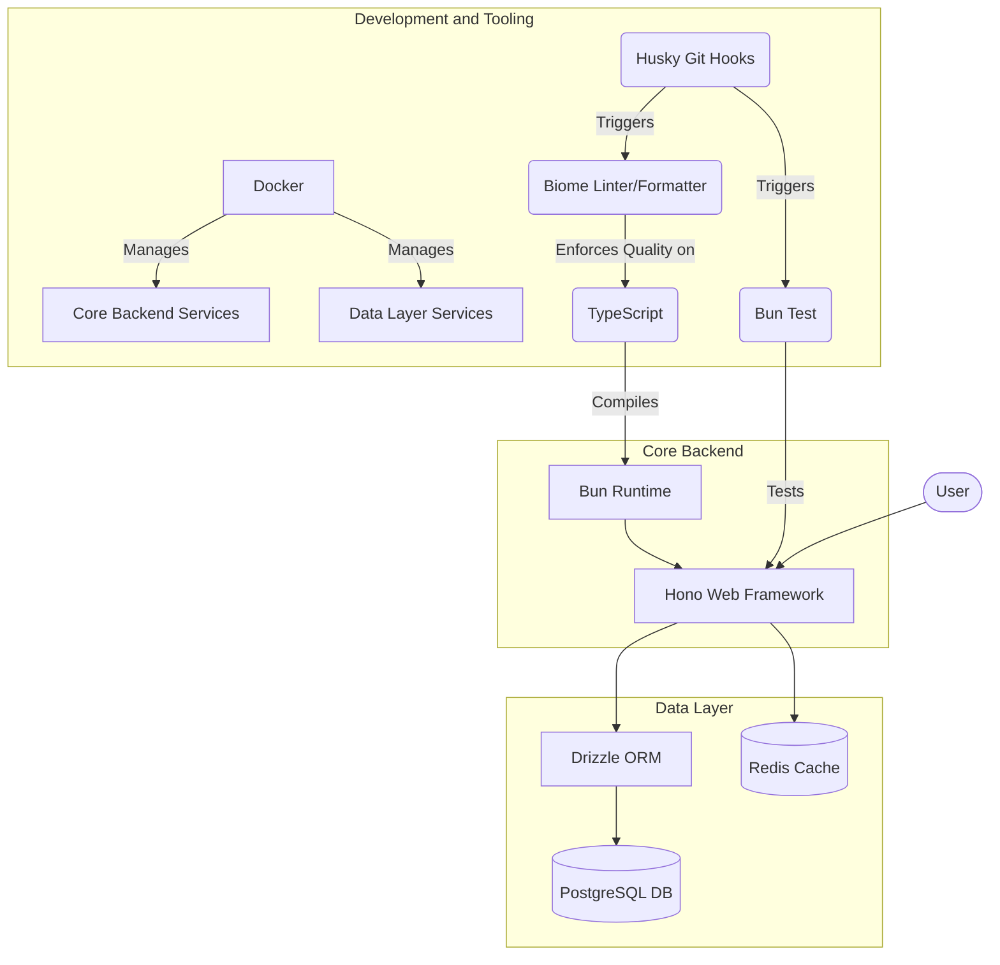

Proyek ini dimulai sebagai sebuah studi kasus: membangun backend API untuk sistem E-Library dari awal. Tujuannya bukan hanya untuk membuat endpoint yang fungsional, tetapi untuk merancang sebuah sistem yang kokoh, teruji, dan menerapkan praktik terbaik dalam pengembangan perangkat lunak modern.

Fokus utama adalah pada pemilihan *tech-stack* yang efisien dan pembentukan arsitektur yang bersih. Untuk itu, teknologi yang dipilih adalah **Bun** sebagai runtime, **Hono** sebagai web framework, dan **Drizzle** sebagai ORM. Kombinasi ini menawarkan performa tinggi dan pengalaman pengembangan yang cepat.

import Mermaid from "@/components/post/Mermaid.astro";

<Mermaid 
    caption="Diagram sederhana dari teknologi utama yang digunakan dalam proyek ini"
>

</Mermaid>

Pembangunan dimulai dari lapisan fondasi, yaitu sistem **otentikasi**. Alur kerja standar seperti registrasi dan login diimplementasikan, kemudian diperkuat dengan mekanisme **Refresh Token** berbasis `HttpOnly` cookie dan alur **Lupa Password** yang aman menggunakan token sekali pakai.

Selanjutnya, arsitektur dipecah menjadi beberapa lapisan yang jelas untuk memastikan *separation of concerns*. **Routes** mendefinisikan "kontrak" API menggunakan `@hono/zod-openapi`, **Handlers** bertindak sebagai jembatan antara lapisan HTTP dan logika bisnis, dan **Repositories** menjadi satu-satunya lapisan yang bertanggung jawab atas akses data.

Fungsionalitas inti, seperti **manajemen buku dan kategori**, dibangun dengan otorisasi berbasis peran (RBAC) yang ketat, di mana hanya `ADMIN` yang dapat melakukan operasi tulis. **Siklus peminjaman buku** diimplementasikan secara penuh, mulai dari permintaan oleh `MEMBER` hingga persetujuan oleh `LIBRARIAN`, lengkap dengan aturan bisnis seperti batas maksimal peminjaman.

Untuk optimasi, **Redis** diintegrasikan sebagai lapisan *caching* pada *resource* yang sering dibaca. Logika *cache-aside* dan *cache invalidation* ditempatkan di dalam *Repository* untuk menjaga agar *Handler* tetap tidak mengetahui detail implementasi caching. Untuk keamanan, **Rate Limiting** per alamat IP juga diterapkan sebagai *middleware* global.

Kualitas kode dijaga secara otomatis. **Biome** digunakan untuk *linting* dan *formatting*, sementara **Husky** berdiri sebagai penjaga gerbang *commit*, memastikan hanya kode terbaik yang bisa masuk. Setiap fitur diuji dengan saksama, memastikan setiap bagian dari mesin ini bekerja tanpa cela.

Hasil akhirnya adalah sebuah backend API yang tidak hanya fungsional tetapi juga terstruktur dengan baik, aman, dan memiliki performa yang dioptimalkan. Fondasi ini sekarang sudah siap untuk langkah selanjutnya, baik itu dihubungkan dengan aplikasi frontend maupun dipersiapkan untuk *deployment* ke lingkungan produksi.

Kamu dapat melihat kode lengkapnya di [GitHub](https://github.com/masmuss/hono-elibrary)