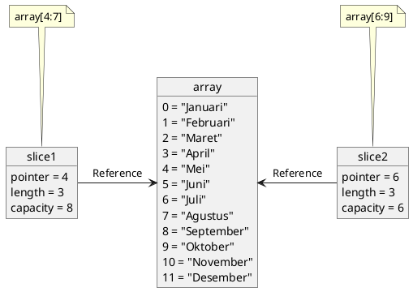

Selamat datang kembali di seri **Becoming Gopher**! Di [petualangan terakhir](./mengulang-perintah-mengenal-perulangan-for-dan-array), kita sudah berhasil menyimpan banyak data menggunakan `array` dan mengolahnya dengan `for` loop. Tapi, mungkin kamu mulai merasakan satu hal...

`array` terasa sedikit kaku, bukan? Ukurannya harus ditentukan di awal dan tidak bisa diubah. Bagaimana jika kita tidak tahu berapa banyak data yang akan kita simpan? Lalu, bagaimana jika kita ingin mengakses data bukan dengan angka indeks `[0]`, tapi dengan kata kunci seperti `"nama"`?

Hari ini, kita akan membuka dua 'jurus sakti' yang akan menjawab semua masalah itu. Selamat datang di dunia `slice` dan `map`, dua tipe data yang akan paling sering kamu gunakan dalam petualangan Go-mu.

1.  **`Slice`**: Kita akan berkenalan dengan si 'array super' yang ukurannya fleksibel dan bisa tumbuh sesuai kebutuhan.
2.  **`Map`**: Lalu, kita akan menguasai `map`, 'lemari arsip' canggih yang memungkinkan kita menyimpan dan mengambil data menggunakan kunci unik.

Ini adalah salah satu episode terpenting dalam seri ini. Jika kamu menguasai `slice` dan `map`, kamu sudah setengah jalan menjadi Gopher yang andal. Mari kita mulai!

## `Slice`: Array Super yang Fleksibel

Pertama, mari kita luruskan satu hal: **`slice` bukanlah pengganti `array`, melainkan sebuah 'pembungkus' cerdas untuk `array`**.

Sebuah `slice` tidak benar-benar menyimpan datanya sendiri. Ia hanya sebuah struktur ringan yang menunjuk ke sebagian (atau seluruh) elemen dari sebuah `array` yang ada di belakang layar (disebut *backing array*).

`Slice` memiliki tiga komponen utama:
1.  **Pointer**: Penunjuk ke elemen pertama di *backing array* yang bisa diakses oleh `slice`.
2.  **Length (Panjang)**: Jumlah elemen yang ada di dalam `slice`.
3.  **Capacity (Kapasitas)**: Jumlah elemen dari `pointer` hingga akhir *backing array*. `Length` tidak boleh lebih dari `Capacity`.

### Cara Membuat dan Memanipulasi Slice

Ada beberapa cara untuk membuat `slice`. Mari kita lihat satu per satu.

#### Membuat Slice dari Array yang Sudah Ada

Ini adalah cara paling harfiah untuk melihat `slice` sebagai "potongan" dari `array`.

| Sintaks | Keterangan |
| :--- | :--- |
| `array[low:high]` | Membuat slice dari index `low` sampai sebelum index `high`. |
| `array[low:]` | Membuat slice dari index `low` sampai akhir `array`. |
| `array[:high]` | Membuat slice dari index 0 sampai sebelum index `high`. |
| `array[:]` | Membuat slice dari seluruh elemen `array`. |

Untuk memahaminya, mari kita lihat diagram berikut. Bayangkan kita punya sebuah `array` berisi nama-nama bulan. Dua `slice` yang berbeda bisa merujuk ke `array` yang sama sebagai backing `array`-nya.



Diagram di atas menunjukkan apa yang akan kita lakukan dalam kode berikut. Kita akan membuat satu `array` bulan, lalu membuat dua `slice` yang merujuk pada `array` tersebut.

```go
var bulan = [...]string{
    "Januari", "Februari", "Maret", // Index 0, 1, 2
    "April", "Mei", "Juni",         // Index 3, 4, 5
    "Juli", "Agustus", "September",  // Index 6, 7, 8
    "Oktober", "November", "Desember",// Index 9, 10, 11
}

// Membuat slice untuk kuartal kedua (April, Mei, Juni)
slice1 := bulan[3:6]
fmt.Printf("Slice 1: %v\n", slice1)
fmt.Printf("Length: %d, Capacity: %d\n", len(slice1), cap(slice1))
// Length: 3 (terdiri dari 3 elemen)
// Capacity: 9 (dihitung dari index 3 sampai akhir array, yaitu index 11. 11-3+1 = 9)

// Membuat slice baru akan mengubah data di backing array asli
// jika kita mengubah elemen di slice
slice1[0] = "AprilDiubah"
fmt.Println("Array bulan setelah slice1 diubah:", bulan) // "April" di array asli akan berubah
```

#### Membuat Slice Secara Langsung (Cara Paling Umum)

Ini terlihat seperti membuat `array`, tapi perbedaannya adalah tidak ada angka di dalam kurung siku `[]`.

```go
// Ini adalah SLICE, bukan array
buah := []string{"Apel", "Mangga", "Jeruk"}
fmt.Println(buah)
fmt.Println("Panjang:", len(buah))   // Panjang: 3
fmt.Println("Kapasitas:", cap(buah)) // Kapasitas: 3 (jumlah elemen yang sama dengan panjang)
```

#### Membuat Slice Kosong dengan `make`

Cara ini memberi kita kontrol penuh atas `length` dan `capacity` awal. Ini sangat berguna untuk performa jika kita sudah tahu kira-kira berapa banyak data yang akan kita simpan.

```go
// Buat slice string dengan panjang 0, tapi kapasitas 5
// Artinya, slice ini kosong, tapi sudah punya ruang untuk 5 elemen.
nama := make([]string, 0, 5)

nama = append(nama, "Rudi")
nama = append(nama, "Siti")

fmt.Println(nama)       // [Rudi Siti]
fmt.Println(len(nama))  // 2
fmt.Println(cap(nama))  // 5
```

#### Fungsi-Fungsi Penting untuk Slice
|Fungsi |	Keterangan|
| :--- | :--- |
| `len(slice)` | Mendapatkan panjang (jumlah elemen yang digunakan) slice.
| `cap(slice)` | Mendapatkan kapasitas (jumlah maksimum elemen sebelum perlu alokasi ulang).
| `append(slice, data...)` | Menambahkan data ke akhir slice.
| `make([]Type, length, capacity)` | Membuat slice baru dengan length dan capacity tertentu.
| `copy(destination, source)` | Menyalin isi slice dari source ke destination.


Fungsi andalan `slice` adalah `append` yang membuatnya terasa dinamis.

```go
angka := []int{1, 2}
angka = append(angka, 3) // Tambahkan 3 ke akhir slice
fmt.Println(angka) // Output: [1 2 3]
```

:::warning
Perilaku `append` yang Wajib Diketahui!
- Jika kapasitas `slice` masih cukup, `append` akan menggunakan backing array yang sama.
- Jika kapasitas tidak cukup, Go akan membuat *backing array* baru (biasanya 2x lipat lebih besar), menyalin semua elemen lama, lalu menambahkan elemen baru.
- Karena itu, selalu simpan hasil `append` ke variabel `slice` yang sama (`slice = append(slice, ...)`).
:::

Fungsi `copy` berguna untuk membuat duplikat `slice` yang benar-benar terpisah (dengan backing array yang berbeda).

```go
sliceAsli := []string{"a", "b", "c"}
sliceSalinan := make([]string, len(sliceAsli))

copy(sliceSalinan, sliceAsli)

sliceSalinan[0] = "x" // Mengubah salinan

fmt.Println("Slice Asli:", sliceAsli)       // Slice Asli: [a b c] (tidak berubah)
fmt.Println("Slice Salinan:", sliceSalinan) // Slice Salinan: [x b c]
```

## `Map`: Lemari Arsip Berbasis Key-Value
Kita sudah bisa menyimpan data berurutan dengan `slice`. Tapi, bagaimana jika kita ingin menyimpan data umur seseorang dan mengaksesnya dengan nama `"Budi"`, bukan dengan `data[0]`? Untuk inilah `map` diciptakan.

`Map` adalah tipe data koleksi yang menyimpan data dalam format pasangan **key-value**.
- **Key**: Penanda unik untuk mengakses data (seperti nama kontak di HP).
- **Value**: Data yang disimpan.

**Karakteristik Map**
- Key Harus Unik: Jika kita menambahkan data dengan key yang sama, data lama akan ditimpa.
- Tipe Key Fleksibel: Key bisa berupa `string`, `int`, atau tipe lain yang bisa dibandingkan.
- Ukuran Dinamis: Kita bisa menambah atau menghapus pasangan *key-value* kapan saja.

**Membuat dan Menggunakan Map**
```go
// Membuat map dengan key string dan value int
dataUmur := map[string]int{
    "Budi": 25,
    "Siti": 23,
    "Eka":  28,
}

// Mengakses data menggunakan key
fmt.Println("Umur Budi:", dataUmur["Budi"]) // Umur Budi: 25

// Menambah atau mengubah data
dataUmur["Rudi"] = 30      // Menambah data baru
dataUmur["Siti"] = 24      // Mengubah data yang sudah ada

// Menghapus data
delete(dataUmur, "Eka")

fmt.Println(dataUmur) // map[Budi:25 Rudi:30 Siti:24]
```

**Jebakan nil dan Jurus "Comma OK"**
Apa yang terjadi jika kita mengakses key yang tidak ada?

```go
fmt.Println("Umur Joko:", dataUmur["Joko"]) // Output: 0
```

Program tidak error, tapi mengembalikan nilai nol (`0` untuk `int`, `""` untuk `string`). Ini berbahaya. Bagaimana kita tahu apakah umur Joko memang 0, atau datanya tidak ada?

Untuk mengatasi ini, gunakan jurus sakti **"comma ok"**.

```go
umur, ok := dataUmur["Joko"]

if ok {
    fmt.Println("Umur Joko adalah", umur)
} else {
    fmt.Println("Data untuk Joko tidak ditemukan.") // Ini yang akan dijalankan
}
```

`ok` akan bernilai `true` jika `key` ditemukan, dan `false` jika tidak. Ini adalah cara paling aman untuk memeriksa keberadaan data di `map`.

## Petualangan Hari Ini Selesai!
Luar biasa! Hari ini kita sudah menguasai dua 'jurus sakti' paling fundamental di Go: `slice` untuk koleksi data yang fleksibel dan `map` untuk penyimpanan data berbasis *key-value*. Dengan dua alat ini di dalam 'ransel' kita, kita sekarang bisa menangani hampir semua skenario pengelolaan data.

Singkatnya, kita sudah belajar:
- Perbedaan mendasar antara `array` dan `slice`.
- Cara membuat dan memanipulasi `slice` menggunakan `append`, `copy` dan `make`.
- Menyimpan dan mengakses data dengan `map` menggunakan *key* yang unik.
- Jurus penting "comma ok" untuk memeriksa data di `map` dengan aman.

Setelah kita bisa mengelola data dengan canggih, langkah selanjutnya adalah membungkus logika kita ke dalam blok-blok yang bisa digunakan kembali. Di petualangan berikutnya, kita akan melakukan *deep dive* ke dunia `function`!

<!-- Punya kasus penggunaan menarik untuk `slice` atau `map`? Bagikan idemu di kolom komentar! Sampai jumpa di bagian keenam! -->