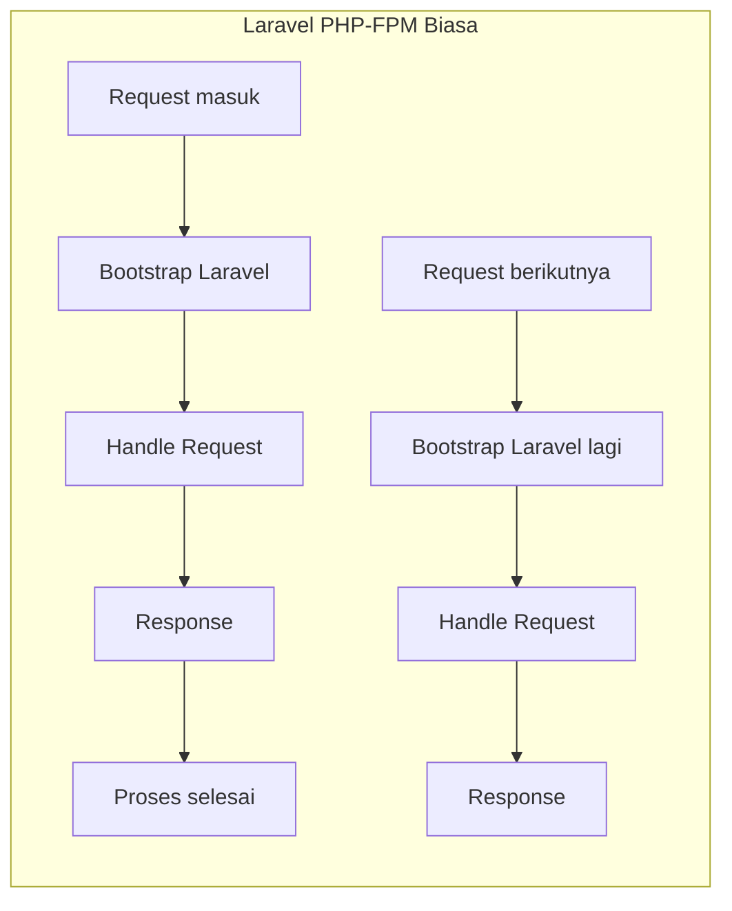
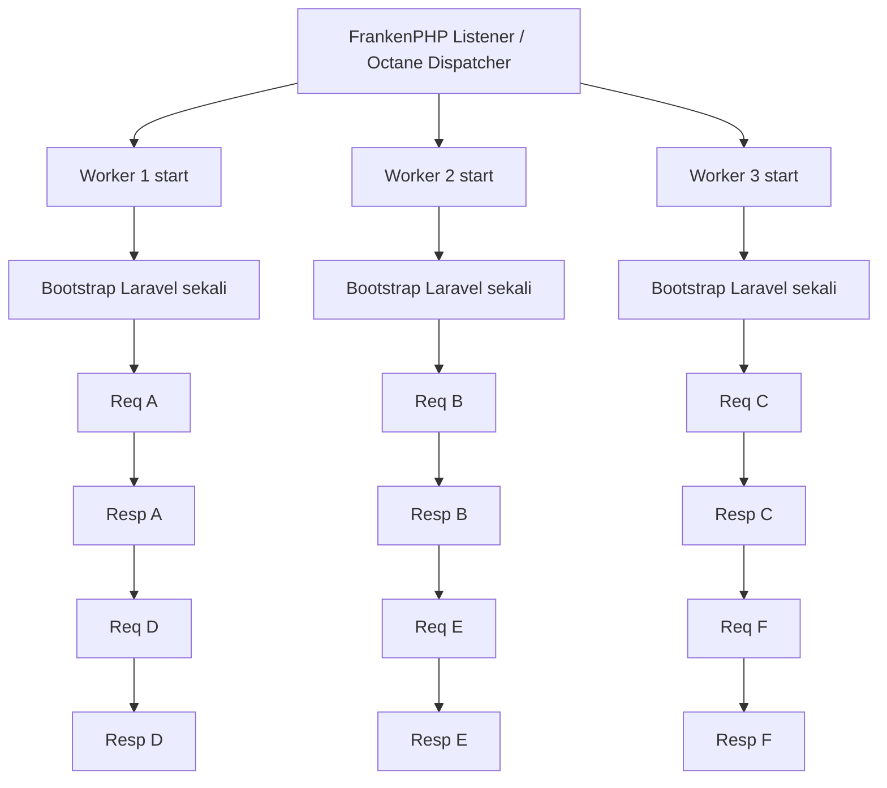

##### tl;dr

- Berawal dari keresahan melihat teman-teman lupa status lamaran kerja mereka.
- Implementasi Laravel Octane + FrankenPHP untuk menangani 100 concurrent users di hardware minim (2C/4GB).
- CI/CD menggunakan GitHub Actions dan GHCR, meski proses update di VM masih manual.
- Fokus pada metrik efektivitas pencarian kerja, bukan sekadar jumlah apply.
- Quick wins: coba aplikasinya di [applyst.masmuss.com](https://applyst.masmuss.com) dan cek source code di GitHub.

---

Semua berawal dari grup chat. Aku sering banget nge-share info lowongan kerja ke teman-teman—bisa sampai puluhan link dalam seminggu. Masalahnya, setelah mereka *apply*, seringkali mereka kehilangan jejak. 

*"Eh, kemarin aku sudah interview di PT X belum ya?"* atau *"Ini sudah seminggu nggak ada kabar, harusnya follow-up kapan ya?"*

Karena nggak ada *traceability*, banyak kesempatan hilang begitu saja. Dari situ aku kepikiran buat bikin **Applyst** di *weekend project* kali ini. Sebuah tempat terpusat buat memantau "medan perang" pencarian kerja.

Kalau kamu penasaran implementasinya, source code project ini ada di sini

::github{repo="masmuss/applyst" label="Lihat di GitHub"}

## Kenapa Harus Laravel Octane & FrankenPHP?

Di proyek ini, aku ingin bereksperimen dengan performa. Biasanya, aplikasi PHP itu punya *overhead* karena harus mem-bootstrap framework (nge-load semua class, config, dan provider) setiap kali ada request masuk. Bayangkan kalau ada 100 orang akses barengan, server bakal kerja keras cuma buat "kenalan" ulang sama Laravel.

Di sini **Laravel Octane** masuk sebagai solusi. Octane menjaga aplikasi tetap *di dalam memori*, jadi bootstrap cuma dilakukan sekali di awal. 

Aku memasangkannya dengan **FrankenPHP**. Kenapa? Karena dia modern, support HTTP/3, dan yang paling penting: efisien. Targetku ambisius: aku ingin Applyst tetap stabil melayani **100 concurrent users** secara bersamaan di hardware "hemat" (hanya 2 Core CPU dan 4GB RAM). Dengan Octane, RAM memang bakal lebih banyak terpakai untuk menjaga *worker* tetap standby, tapi *response time* jadi jauh lebih instan.

Biar kebayang bedanya, ini ilustrasi sederhana alur request sebelum dan sesudah pakai Octane:

Intinya, di mode biasa proses bootstrap berulang tiap request, sedangkan di Octane bootstrap dilakukan sekali saat worker hidup lalu request berikutnya diproses jauh lebih cepat.

## Ngetes 100 Concurrent User: Pakai Apa?

Di iterasi ini, aku fokus pakai dua sumber data: hasil **k6** untuk metrik HTTP dan log **top** untuk metrik resource di VPS. Endpoint yang dites masih landing page (belum menyentuh query database), jadi hasilnya kuposisikan sebagai baseline awal.

Metrik utama yang kupakai:

1. **Latency**: avg, p90, p95, p99, dan max.
2. **Reliability**: `http_req_failed`, `non_2xx_rate`, dan `checks`.
3. **Throughput**: `http_reqs` dan total iterations.
4. **Resource server**: `%Cpu(s)`, `MiB Mem`, swap usage, dan iowait (`wa`) dari `top`.

Ringkasan hasil uji (100 VUs, 60 detik):

| Metrik | Nilai |
| --- | --- |
| HTTP req duration p95 | 233.03 ms |
| HTTP req duration p99 | 488.74 ms |
| HTTP req duration max | 802.86 ms |
| Throughput (`http_reqs`) | 85.95 req/s |
| `http_req_failed` | 0.00% |
| `non_2xx_rate` | 0.39% (21/5254) |
| CPU saat beban | user+system dominan di kisaran 50-60% |
| I/O wait (`wa`) | umumnya 5-10% saat fase puncak |
| Memori | relatif stabil, swap nyaris tidak terpakai |

Interpretasi singkatku:

1. Baseline landing page ini sudah cukup sehat untuk 100 VUs.
2. Latency p95 dan p99 masih nyaman, walau sesekali ada spike di max latency.
3. Resource server masih punya headroom, tapi iowait yang muncul berkala jadi sinyal awal bahwa bottleneck I/O bisa muncul saat skenario makin berat.

## Bedah Fitur MVP

Di versi MVP ini, aku nggak mau Applyst cuma jadi tabel biasa. Aku fokus pada metrik yang benar-benar membantu *job seeker*:

1.  **Tracking History & Status**: Setiap perubahan status (dari *Applied* ke *Interview*, atau *Ghosted*) terekam jejaknya.
2.  **Response & Conversion Rate**: Aku ingin user tahu seberapa efektif CV mereka. Berapa persen lamaran yang berlanjut ke tahap interview?
3.  **Oldest Active Application**: Fitur ini bakal nge-ping kita kalau ada lamaran yang sudah terlalu lama "nganggur" tanpa kabar.
4.  **Follow-up Reminders**: Karena lupa adalah musuh utama, sistem *reminder* ini jadi krusial buat menjaga komunikasi dengan rekruiter tetap terjaga.

## Alur CI/CD: Otomatis tapi Manual

Untuk urusan *deployment*, aku sudah mulai menerapkan standar yang lebih rapi. Aku pakai **GitHub Actions** untuk otomatisasi *build* image Docker setiap kali ada *push* ke repository. Image tersebut langsung didorong ke **GHCR (GitHub Container Registry)**.

Meskipun *build*-nya sudah otomatis, untuk proses *update* di VM Proxmox-ku, aku masih memilih cara manual. Aku harus SSH ke server, melakukan `docker compose pull`, lalu *restart* container-nya. Agak sedikit repot, tapi memberiku kontrol penuh untuk memastikan migrasi database dan *state* Octane tetap aman setiap kali ada versi baru.

## Akhir Kata

Applyst bukan cuma soal mencatat lamaran, tapi soal punya *awareness* terhadap proses pencarian kerja kita sendiri. Dengan bantuan *tech stack* yang tepat seperti Octane dan FrankenPHP, aplikasi ini siap jadi teman berjuang buat teman-temanku (dan mungkin orang lain nanti) tanpa perlu hardware server yang mahal.

*Next step?* Mungkin optimasi *insulation* kamar dulu supaya server homelab-ku nggak terlalu kepanasan. *Happy coding!*