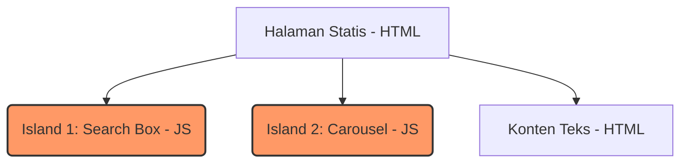

Biasanya, kalau bicara “fitur framework”, yang muncul adalah daftar panjang istilah teknis. Jujur saja, itu sering bikin orang langsung tutup tab.

Di tulisan ini, aku ingin membahas fitur utama Astro dengan cara yang lebih sederhana. Anggap saja kita sedang ngobrol santai soal **kenapa Astro bekerja seperti ini**, bukan bagaimana cara menulis kodenya.

## HTML First: Seperti Menulis Surat, Bukan Presentasi PowerPoint

Di Astro, HTML adalah yang utama. Bukan hasil sampingan, bukan sesuatu yang baru bisa dibaca setelah JavaScript selesai.

Bayangkan kamu ingin menyampaikan pesan:

- HTML itu seperti **surat tertulis**
- JavaScript itu seperti **presentasi dengan animasi**

Untuk banyak kasus, surat sudah lebih dari cukup. Pesannya sampai, cepat, dan tidak ribet.

Astro memilih mengirim “surat” dulu. Kalau perlu animasi atau interaksi, baru kita tambahkan.

## Zero JavaScript by Default: Bukan Anti, Tapi Hemat

“Zero JavaScript” sering disalahpahami.
Bukan berarti Astro tidak bisa JavaScript.

Ini lebih mirip:

- lampu di rumah **tidak menyala semua sekaligus**
- kamu nyalakan hanya ruangan yang dipakai

Di Astro:

- kalau tidak perlu JavaScript, ia tidak dikirim
- browser tidak dibebani hal yang tidak dipakai
- halaman tetap bisa dibaca tanpa menunggu apa pun

Hemat, bukan pelit.

## Island Architecture: Warung di Tengah Lapangan

Island Architecture terdengar besar, padahal idenya sangat sederhana.

Bayangkan sebuah lapangan luas:

- rumputnya itu HTML
- di tengahnya ada satu warung kecil yang ramai

Warung itu:

- punya listrik sendiri
- ada interaksi
- ada aktivitas

Tapi **tidak seluruh lapangan perlu listrik**.

*Visualisasi Island Architecture: Hanya bagian yang berwarna (Island) yang memiliki JavaScript/listrik.*

Di Astro:

- hanya bagian yang interaktif yang pakai JavaScript
- sisanya tetap ringan dan statis
- tidak semua halaman diperlakukan sama

:::tip
Kamu bisa baca lebih dalam tentang [Island Architecture](https://docs.astro.build/en/concepts/islands/) di dokumentasi resmi Astro.
:::

Ini membuat website terasa cepat tanpa harus mengorbankan interaksi.

## Partial Hydration: Tidak Semua Harus Bangun Sekaligus

Framework lain sering menghidupkan semua komponen sekaligus.
Seperti menyalakan seluruh gedung walau cuma pakai satu ruangan.

Astro memilih:

- bangun yang perlu
- diamkan yang tidak

Beberapa bagian bisa:

- aktif saat halaman dibuka
- aktif saat terlihat
- aktif saat dibutuhkan

:::note
Teknik ini disebut **Partial Hydration**, di mana kita hanya "menghidupkan" komponen tertentu di waktu yang tepat.
:::

Lebih efisien, lebih masuk akal.

## Framework-Agnostic: Alat Masak Boleh Campur

Astro tidak peduli kamu:

- pakai React
- pakai Vue
- pakai Svelte
- atau HTML murni

Ini seperti dapur, kamu boleh pakai pisau apa saja, yang penting masakannya jadi. Astro tidak memaksa satu cara. Ia memberi kebebasan tanpa kekacauan.

## Fitur-Fitur Ini Sebenarnya Satu Cerita

Kalau diperhatikan, semua fitur ini tidak berdiri sendiri. Mereka mengikuti satu pola yang sama:

- kirim lebih sedikit
- aktifkan seperlunya
- jangan membebani user

Astro bukan ingin terlihat pintar. Ia hanya ingin tidak berlebihan.

Fitur Astro terasa masuk akal karena dekat dengan kehidupan sehari-hari:

- kita tidak membawa semua barang saat keluar rumah
- kita tidak menyalakan semua lampu
- kita tidak memasak semua menu sekaligus

Website juga seharusnya begitu.

Di tulisan berikutnya, kita akan mulai menyentuh praktik: bagaimana memulai project Astro pertama, tanpa perlu langsung paham semuanya.
