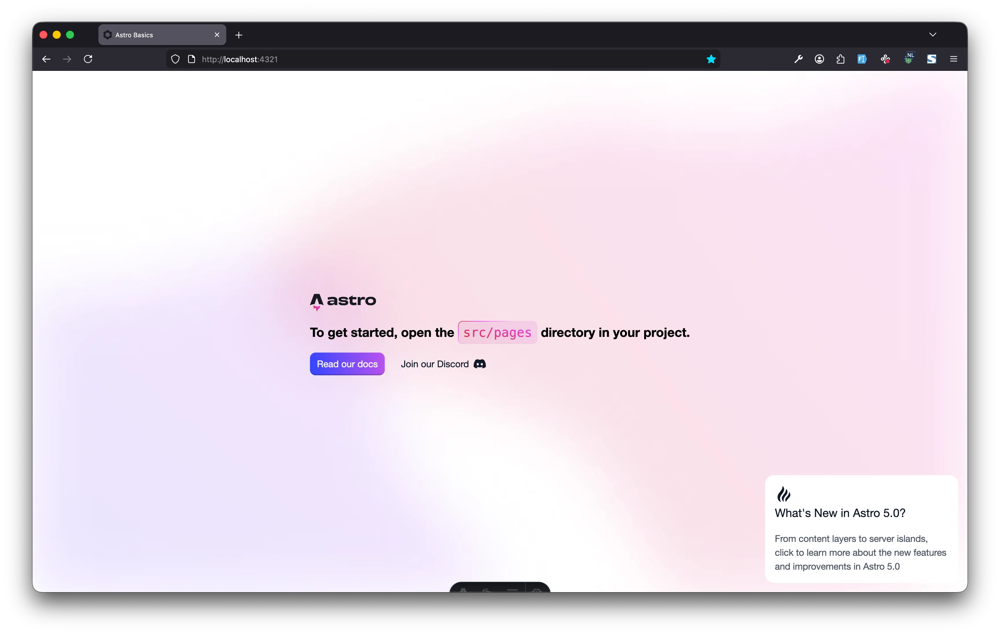

Setelah menuntaskan teori di Bagian 1, sekarang saatnya kita benar-benar membangun sesuatu. Kita akan mulai dari yang paling dasar: **menyiapkan lingkungan kerja dan membuat halaman pertama.**

## Langkah 1: Persiapan Senjata

Sebelum mulai, pastikan kamu sudah menginstall **Node.js** (versi 18.17.1 atau lebih baru) di komputermu. Jika sudah, buka terminal dan jalankan perintah sakti ini:

```bash title="Terminal (npm create astro)"
npm create astro@latest

astro   Launch sequence initiated.

   dir   Where should we create your new project?
         ./my-astro-site

  tmpl   How would you like to start your new project?
         A basic, helpful starter project

  deps   Install dependencies?
         Yes

   git   Initialize a new git repository?
         No
      ◼  Sounds good! You can always run git init manually.

 ██████  Project initializing...
         ■ Template copied
         ▶ Dependencies installing with npm...
         ✔  Project initialized!
         ■ Template copied
         ■ Dependencies installed

  next   Liftoff confirmed. Explore your project!

         Enter your project directory using cd ./my-astro-site
         Run npm run dev to start the dev server. CTRL+C to stop.
         Add frameworks like react or tailwind using astro add.

         Stuck? Join us at https://astro.build/chat

╭──🎩─╮  Houston:
│ ◠ ◡ ◠  Good luck out there, astronaut! 🚀
╰──🎀─╯
```

Astro akan menyambutmu dengan ramah. Ikuti beberapa langkah interaktif ini:

1. **Where should we create your new project?** (Ketik nama foldernya, misal: `./my-astro-site`)
2. **How would you like to start your new project?** (Pilih `A basic, helpful starter project`)
3. **Install dependencies?** (Pilih `Yes`)
4. **Initialize a new git repository?** (Pilih `Yes` atau `No` sesuai kebutuhan)
5. **Do you plan on writing TypeScript?** (Pilih `Yes` untuk keamanan tipe, atau `No` untuk pemula)

## Langkah 2: Menjalankan Server Lokal

Masuk ke folder projectmu dan jalankan server pengembangan:

```bash
cd my-astro-site
npm run dev
```

```bash title="Terminal (npm run dev)"
❯  npm run dev

> my-astro-site@0.0.1 dev
> astro dev

10:26:34 [types] Generated 1ms
10:26:34 [content] Syncing content
10:26:35 [content] Synced content

 astro  v5.16.6 ready in 108 ms

┃ Local    http://localhost:4321/
┃ Network  use --host to expose

10:26:35 watching for file changes...
```

Sekarang, buka browser dan akses `http://localhost:4321`. 



Jika kamu melihat halaman selamat datang Astro, selamat! Kamu sudah setengah jalan.

## Langkah 3: Membedah Halaman Pertama

Buka folder projectmu di VS Code. 

```plaintext title="Struktur Folder"
.
├── .vscode
│   ├── extensions.json
│   └── launch.json
├── public
│   └── favicon.svg
├── src
│   ├── assets
│   │   ├── astro.svg
│   │   └── background.svg
│   ├── components
│   │   └── Welcome.astro
│   ├── layouts
│   │   └── Layout.astro
│   └── pages
│       └── index.astro
├── .gitignore
├── astro.config.mjs
├── package.json
├── README.md
└── tsconfig.json
```

Cari file `src/pages/index.astro`. Ini adalah halaman utama websitemu.

Coba ubah isinya menjadi seperti ini:

```astro title="src/pages/index.astro"
---
const title = "Project Pertamaku";
---

<html lang="en">
  <head>
    <meta charset="utf-8" />
    <title>{title}</title>
  </head>
  <body>
    <h1>Halo, Dunia Astro!</h1>
    <p>Ini adalah langkah kecil untukku, tapi langkah besar untuk perjalananku menjadi Astron.</p>
  </body>
</html>
```

Simpan file tersebut, dan lihat browsermu. Halaman akan otomatis diperbarui tanpa perlu kamu refresh!

## Langkah 4: Menambahkan Halaman Baru

Ingat prinsip **File-based Routing**? Mari kita coba.
Buat file baru bernama `src/pages/tentang.astro` dan isi dengan:

```astro title="src/pages/tentang.astro"
---
---
<h1>Tentang Saya</h1>
<p>Saya sedang belajar Astro dan ini sangat menyenangkan!</p>
<a href="/">Kembali ke Beranda</a>
```

Sekarang akses `http://localhost:4321/tentang` di browsermu. Ajaib, kan? Tanpa konfigurasi routing yang rumit, halaman barumu sudah hidup.

## Apa Selanjutnya?

Kamu sudah berhasil:
- Membuat project Astro.
- Menjalankan server lokal.
- Mengubah konten halaman utama.
- Membuat halaman baru dengan routing otomatis.

Di tulisan berikutnya, kita akan belajar bagaimana membuat **Layout** agar kita tidak perlu menulis tag `<html>` dan `<head>` berulang-ulang di setiap halaman.

:::tip
Jangan takut untuk mencoba mengubah kode dan melihat apa yang terjadi. Itulah cara terbaik untuk belajar!
:::
